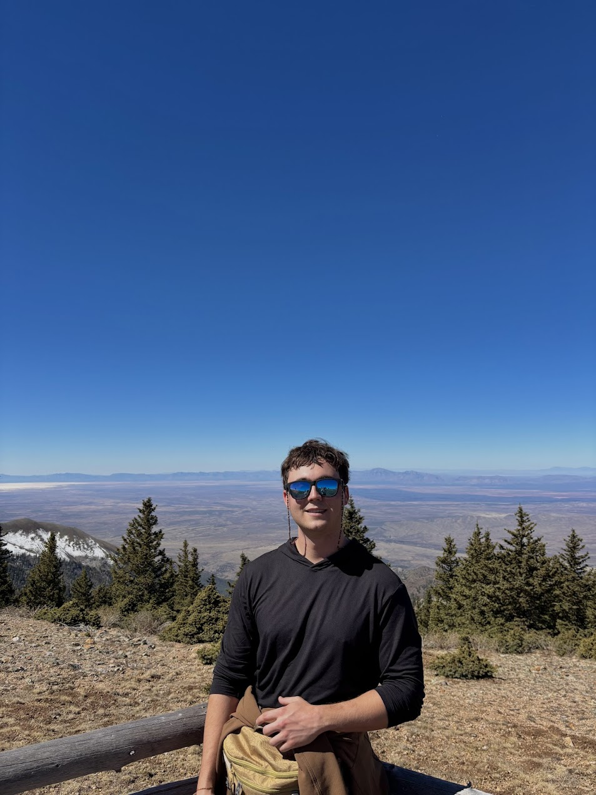
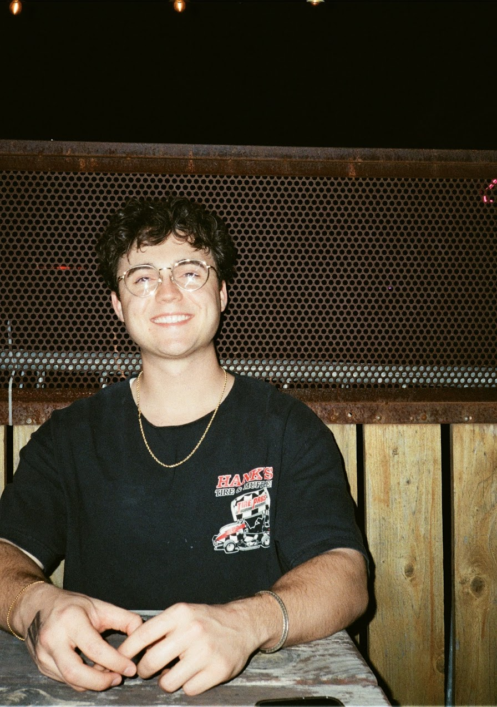

```{=html}
<div class="photo-grid">
  
  
</div>
```

I'm a Research Associate with the Advanced Law Enforcement Rapid Response Training (ALERRT) Center at Texas State University, where I focus on turning data into life-saving strategies for first responders. My work bridges research and real-world application, studying things like how officers respond under stress, how the public perceives police use of force, and how active attacks unfold.

Before moving into research full-time, I worked as a Logistics Specialist at ALERRT, helping coordinate large-scale training deployments across the country. That experience gave me a ground-level understanding of how the work actually gets done, which I think makes me a better researcher.

I'm currently finishing a Master of Science in Criminal Justice at Texas State, holding a 4.0 GPA while working full-time, which I'm genuinely proud of.

Outside of work: strong coffee is non-negotiable, I'm always tinkering with some tech project (this site is one of them), my best Rubik's cube solve is 42 seconds, and I shoot film photography when I can.
