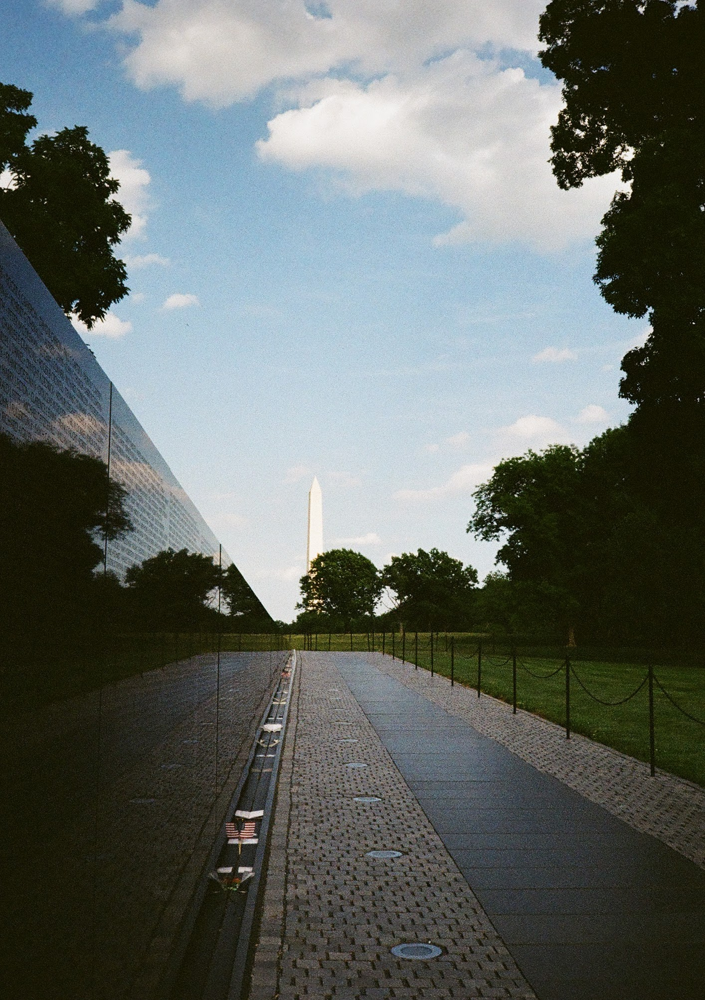
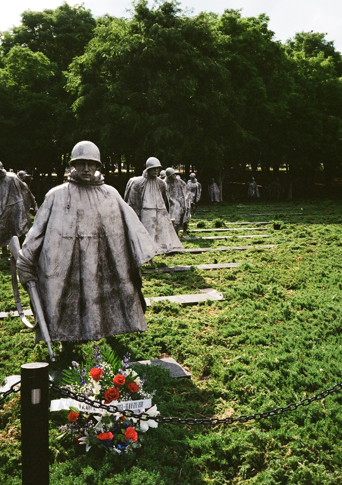
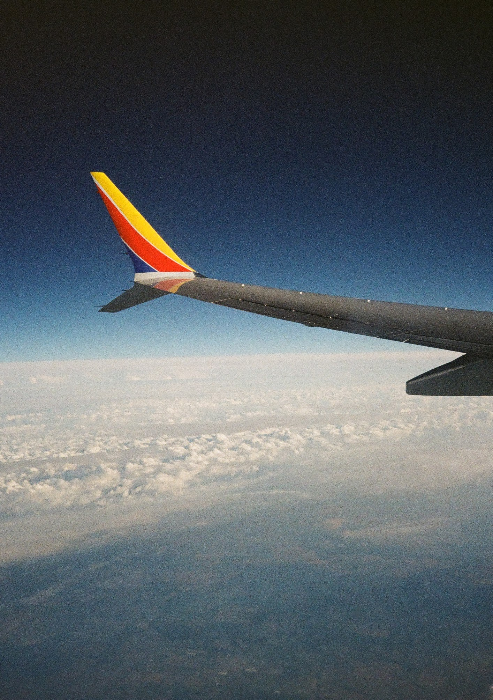
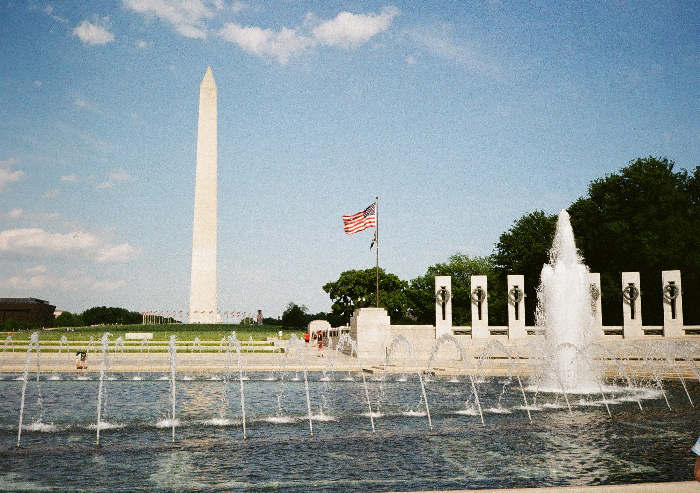
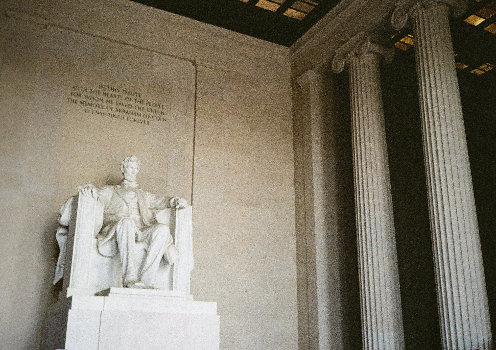

I was able to visit Washington D.C. for the first time in 20 years last week. Prior to that I came with my family when I was too young to remember anything. It was good to be out and see all the things to see again with the ability to appreciate them now. I took a camera, and with the remaining afternoon from travel, I started walking.

I didn't really have a plan, I just wanted to get to the National Mall and hit some museums while walking East to West to see all of the monuments. I was able to see the Smithsonian of Natural History, Air & Space, and the Holocaust museums. If I had the time to take all day in those three places I easily could have, but even just going through quickly was easily the most exciting part of the trip. The war memorials were another highlight of it all, a little more private, and something you don't really understand or appreciate as a kid.

The next three days were spent with coworkers at the American Society of Evidence Based Policing Conference. This was the first work conference I had ever attended and it wasn't too bad. It was a unique experience just being able to listen to people a lot smarter than me talk about their passions and what interests them. 

I was really most excited to just take some pics while there too, here are some good ones :)

::: {layout-ncol=3}

:::